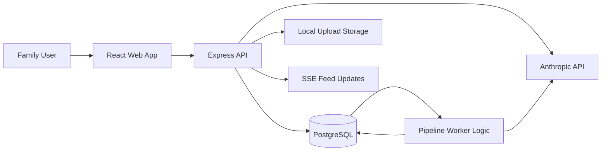

# Havenhold

Havenhold is a family care coordination app that brings appointments, medications, and clinical notes into one shared timeline, with async document processing and AI-assisted summaries.

## Why Havenhold

Care coordination for family members is often fragmented across portals, paper notes, and text threads. Havenhold is designed to:

- Centralize key health information for one patient profile.
- Support collaborative family workflows (appointments, medications, notes, comments).
- Use an asynchronous AI pipeline to extract and simplify medical documents.

## MVP Scope (Current)

- Family feed with appointment/medication/document activity.
- Manual appointment and medication management.
- Document upload and AI processing pipeline.
- Review workflow for AI-extracted items.
- Medication interaction checks.
- Family member listing and invite scaffolding.

## Architecture Overview



- Frontend: React + Vite + TypeScript.
- Backend: Express + TypeScript.
- Data layer: Prisma + PostgreSQL.
- AI: Anthropic API for extraction/simplification/interaction checks.
- Realtime updates: SSE feed events.

See [docs/architecture.md](docs/architecture.md) for deeper details and target evolution.

## Repository Layout

```text
Havenhold/
├── src/                  # React frontend
├── server/
│   ├── prisma/           # Prisma schema, migrations, seed
│   └── src/              # Express API routes, pipeline logic
├── docker-compose.yml    # Local Postgres
└── IMPLEMENTATION_PLAN.md
```

## Local Setup (Clean Clone)

### Prerequisites

- Node.js 22+
- npm 10+
- Docker Desktop

### 1. Install dependencies

```bash
npm install
cd server && npm install && cd ..
```

### 2. Start PostgreSQL

```bash
docker compose up -d
```

### 3. Configure backend env

```bash
cd server
cp .env.example .env
cd ..
```

### 4. Run migrations and seed demo data

```bash
cd server
npm run db:migrate
npm run db:seed
cd ..
```

After seeding, copy the printed patient and demo user ids into:

- `server/.env` as `DEMO_PATIENT_ID` and `DEMO_USER_ID`
- root `.env` as `VITE_DEMO_PATIENT_ID` and `VITE_DEMO_USER_ID`

### 5. Configure frontend env

The frontend currently reads:

```bash
cp .env.example .env
VITE_DEMO_PATIENT_ID=<seeded-patient-id>
VITE_DEMO_USER_ID=<seeded-user-id>
```

### 6. Run backend and frontend

Terminal 1:

```bash
cd server
npm run dev
```

Terminal 2:

```bash
npm run dev
```

Frontend runs at `http://localhost:8080`, API runs at `http://localhost:3001`.

## Scripts

### Frontend (root)

- `npm run dev` - start Vite dev server
- `npm run build` - production frontend build
- `npm run test` - run Vitest tests
- `npm run lint` - run ESLint

### Backend (`server/`)

- `npm run dev` - run API server with watch mode
- `npm run build` - compile backend TypeScript
- `npm run db:migrate` - apply Prisma migrations
- `npm run db:seed` - seed demo data
- `npm run db:studio` - open Prisma Studio

## Security and Privacy Notes

This project handles health-related data and should be treated carefully, even as an MVP.

- Use synthetic/demo data locally and in public demos.
- Do not commit secrets or production PHI.
- The current auth middleware is demo-only and must be replaced before real use.
- Uploaded files are currently stored locally (`server/uploads`) for MVP development.
- The pipeline includes de-identification before AI processing, but this is not a full compliance implementation.

## Contributing

See [CONTRIBUTING.md](CONTRIBUTING.md) for branch naming, PR expectations, and quality checks.

## License

No license has been set yet.
