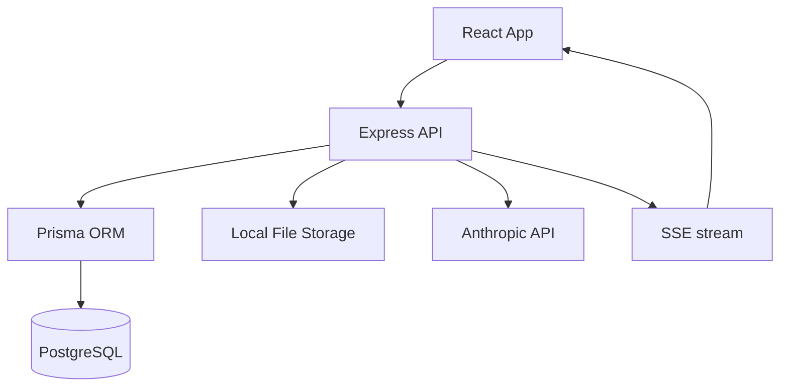

# Havenhold Architecture

## System Context

Havenhold is a single-patient family care coordination MVP. The current architecture optimizes for:

- Fast iteration.
- Low operational cost.
- Clear path to async-first production patterns.

## Current Runtime Architecture

## Core Subsystems

### Frontend (`src/`)

- React + TypeScript + Vite app.
- Uses TanStack Query for server state.
- Displays pipeline state updates via SSE.

### API (`server/src/`)

- Express routes for appointments, medications, documents, feed, comments, and family.
- Handles document upload and kicks off pipeline stages.
- Emits feed/pipeline updates through SSE.

### Data (`server/prisma/`)

- PostgreSQL schema managed via Prisma migrations.
- Seed script creates demo family/patient data.

### AI Pipeline (`server/src/lib/pipeline.ts`)

Pipeline stages:

1. Extract structured entities (appointments, medications, instructions).
2. Simplify clinician notes into plain-language summary.
3. Check medication interactions.
4. Generate follow-up questions.

## Security Posture (Current)

- Local/dev only posture.
- Demo auth middleware is active and not production-safe.
- Local file storage for uploads.
- Environment variables for API keys and database URL.
- Basic de-identification before AI calls.

## Planned Evolution

Target architecture direction:

1. Split API and worker process ownership.
2. Queue-backed async jobs (SQS-compatible workflow).
3. Private object storage with signed URLs.
4. Strong authN/authZ and patient membership roles.
5. Audit trails and encrypted storage at rest and in transit.

## Deployment Model (Planned)

For low-cost MVP hosting:

- Single compute instance hosting frontend, API, and worker process.
- PostgreSQL on the same instance initially.
- Incremental migration path to managed DB, managed queue, and object storage.
